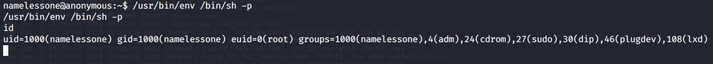

# Anonymous

Not the hacking group

Room URL: https://tryhackme.com/room/anonymous

---

# Task 1

1. Enumerate the machine.  How many ports are open?

Took a while for the box to spin up. Let's use nmap.

```
$ nmap -sC -sV 10.10.120.121
Starting Nmap 7.80 ( https://nmap.org ) at 2020-06-04 17:49 CEST
Nmap scan report for 10.10.120.121
Host is up (0.079s latency).
Not shown: 996 closed ports
PORT    STATE SERVICE     VERSION
21/tcp  open  ftp         vsftpd 2.0.8 or later
| ftp-anon: Anonymous FTP login allowed (FTP code 230)
|_drwxrwxrwx    2 111      113          4096 May 17 21:30 scripts [NSE: writeable]
| ftp-syst:
|   STAT:
| FTP server status:
|      Connected to ::ffff:10.9.31.145
|      Logged in as ftp
|      TYPE: ASCII
|      No session bandwidth limit
|      Session timeout in seconds is 300
|      Control connection is plain text
|      Data connections will be plain text
|      At session startup, client count was 4
|      vsFTPd 3.0.3 - secure, fast, stable
|_End of status
22/tcp  open  ssh         OpenSSH 7.6p1 Ubuntu 4ubuntu0.3 (Ubuntu Linux; protocol 2.0)
| ssh-hostkey:
|   2048 8b:ca:21:62:1c:2b:23:fa:6b:c6:1f:a8:13:fe:1c:68 (RSA)
|_  256 e1:2a:96:a4:ea:8f:68:8f:cc:74:b8:f0:28:72:70:cd (ED25519)
139/tcp open  netbios-ssn Samba smbd 3.X - 4.X (workgroup: WORKGROUP)
445/tcp open  netbios-ssn Samba smbd 4.7.6-Ubuntu (workgroup: WORKGROUP)
Service Info: Host: ANONYMOUS; OS: Linux; CPE: cpe:/o:linux:linux_kernel

Host script results:
|_clock-skew: mean: 0s, deviation: 2s, median: 0s
|_nbstat: NetBIOS name: ANONYMOUS, NetBIOS user: <unknown>, NetBIOS MAC: <unknown> (unknown)
| smb-os-discovery:
|   OS: Windows 6.1 (Samba 4.7.6-Ubuntu)
|   Computer name: anonymous
|   NetBIOS computer name: ANONYMOUS\x00
|   Domain name: \x00
|   FQDN: anonymous
|_  System time: 2020-06-04T15:49:40+00:00
| smb-security-mode:
|   account_used: guest
|   authentication_level: user
|   challenge_response: supported
|_  message_signing: disabled (dangerous, but default)
| smb2-security-mode:
|   2.02:
|_    Message signing enabled but not required
| smb2-time:
|   date: 2020-06-04T15:49:40
|_  start_date: N/A
```
Looks like some samba we could possibly exploit.

```
4
```

2. What service is running on port 21?

```
ftp
```

3. What service is running on ports 139 and 445?

```
smb
```

4. There's a share on the user's computer.  What's it called?

nmap actually has a built in script for this. Let's run it!

```
$ nmap --script smb-enum-shares.nse -p445 10.10.120.121
Starting Nmap 7.80 ( https://nmap.org ) at 2020-06-04 17:52 CEST
Nmap scan report for 10.10.120.121
Host is up (0.10s latency).

PORT    STATE SERVICE
445/tcp open  microsoft-ds

Host script results:
| smb-enum-shares:
|   account_used: guest
|   \\10.10.120.121\IPC$:
|     Type: STYPE_IPC_HIDDEN
|     Comment: IPC Service (anonymous server (Samba, Ubuntu))
|     Users: 1
|     Max Users: <unlimited>
|     Path: C:\tmp
|     Anonymous access: READ/WRITE
|     Current user access: READ/WRITE
|   \\10.10.120.121\pics:
|     Type: STYPE_DISKTREE
|     Comment: My SMB Share Directory for Pics
|     Users: 0
|     Max Users: <unlimited>
|     Path: C:\home\namelessone\pics
|     Anonymous access: READ
|     Current user access: READ
|   \\10.10.120.121\print$:
|     Type: STYPE_DISKTREE
|     Comment: Printer Drivers
|     Users: 0
|     Max Users: <unlimited>
|     Path: C:\var\lib\samba\printers
|     Anonymous access: <none>
|_    Current user access: <none>
```

```
pics
```

5. user.txt

Looks like the samba share is anonymously accessible and contains two very cute
dog pictures. The file format is jpeg. I've run `binwalk` against them but it
didn't result in anything, so that's probably just a distraction.

The FTP server is also anonymously accesslible. It contains several files and
what seems to be a script which is possibly run in a cron every minute or so. It
has a chmod of 757. Could we exploit that? Yes, holy hell that took me way too
long. I'm not sure what was going on but I couldn't get a shell. I eventually
got it. I modified the `clean.sh` file to pop a shell.

```
90d6f9925815ff991e68748c414740
```

6. root.txt

It seems we are in a group called `lxd`, something to do with containers
(docker). It seems there's a [known
exploit](https://www.exploit-db.com/exploits/46978) by using some `build-alpine`
script. Let's try that. Could not get that to work.

`find / -perm /4000` shows there's suid on `/usr/bin/env` we could just run that
with a `/bin/sh -p` parameter and hey preso, our euid is now root.



```
4d930091c31a622a7ed10f27999af363
```
